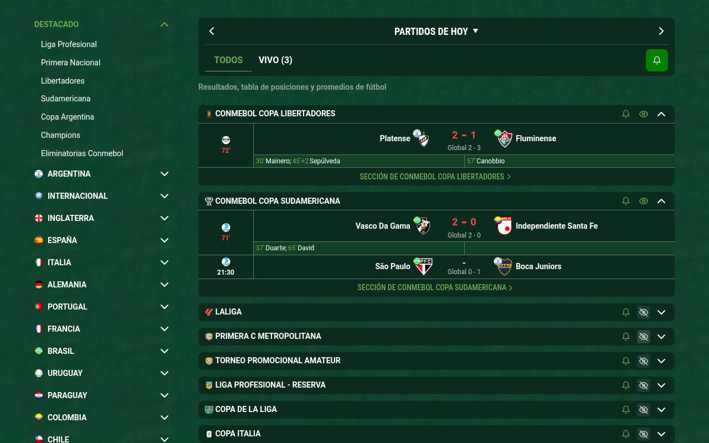

# Promiedos Plus


**Promiedos Plus 1.0.1** es una extensión de Chrome para personalizar [Promiedos](https://www.promiedos.com.ar/): dejá las competiciones que te interesan primero y ocultá las apuestas y el encabezado de escritorio.

Es un proyecto independiente, sin afiliación con Promiedos.

## Qué hace

- Agrega un **ojo junto a la campanita** de cada competición.
- Al pulsarlo, **colapsa la competición y la ubica al final de la lista**. El título sigue visible para que puedas recuperarla.
- Al volver a pulsarlo, **expande la competición y la devuelve a su posición original**.
- **Recuerda tu selección** al recargar, cambiar de fecha o cerrar Chrome; también la mantiene entre pestañas del mismo sitio.
- **Oculta las apuestas:** cuotas de los partidos, botón CUOTAS, su aviso, promociones y banners de Adsage, incluido el espacio que ocupan.
- **Oculta el encabezado principal en escritorio.** En la vista móvil lo conserva para que puedas abrir y cerrar el menú de Promiedos. Se adapta al cambiar el ancho de la ventana.
- **Conserva ambos enlaces a cada competición:** el título y el enlace inferior «Sección de…».

## Cómo se usa

| Icono | Estado |
| --- | --- |
| Ojo verde | La competición permanece en su posición habitual. La flecha original permite colapsarla temporalmente. |
| Ojo tachado | La competición queda colapsada al final. Pulsá el ojo para recuperarla. |

Las competiciones conservan el orden relativo dentro de cada grupo. Las ocultas quedan después de las visibles, antes del calendario inferior. El ojo sigue disponible aunque desactives el sonido general y desaparezcan las campanitas.

La configuración se realiza desde estos ojos; el icono de la barra de Chrome identifica la extensión y no abre un panel de ajustes.



## Instalación manual

**[Descargar Promiedos Plus 1.0.1 (ZIP listo para instalar)](https://github.com/tomviglini/promiedos-chrome-extension/releases/download/v1.0.1/promiedos-plus-1.0.1.zip)** · [Ver versiones publicadas](https://github.com/tomviglini/promiedos-chrome-extension/releases).

1. Descargá `promiedos-plus-1.0.1.zip` desde **Assets / Recursos** del release y elegí **Extraer aquí / Extract here**. El ZIP contiene la carpeta `promiedos-plus-1.0.1`, que agrupa todos los archivos de la extensión.
2. Abrí `chrome://extensions`.
3. Activá **Modo de desarrollador**.
4. Pulsá **Cargar descomprimida** —o **Load unpacked**— y seleccioná la carpeta `promiedos-plus-1.0.1`, que contiene `manifest.json`. Chrome no acepta un ZIP en esta opción.
5. Recargá Promiedos si ya lo tenías abierto.

No hace falta instalar dependencias ni compilar para usar la extensión. Las instrucciones de carga manual también están en la [documentación de Chrome](https://developer.chrome.com/docs/extensions/get-started/tutorial/hello-world#load-unpacked).

Para actualizar, reemplazá los archivos de la carpeta instalada, pulsá **Recargar** en la tarjeta de la extensión y recargá Promiedos. Si instalás esta versión en otra carpeta, desactivá la anterior para evitar que se ejecuten ambas.

## Preferencias y privacidad

Las preferencias se guardan por ID de competición en el `localStorage` de Promiedos. La clave sigue siendo `promiedos-focus:hidden-leagues:v1` para conservar las selecciones de las versiones anteriores con el nombre Promiedos Focus.

- No se envían datos a un servidor de la extensión y no se necesita una cuenta.
- Borrar los datos de Promiedos elimina las preferencias.
- No se sincronizan entre computadoras, perfiles de Chrome o los dominios con y sin `www`.
- Los scripts del propio sitio pueden acceder a su `localStorage`.
- La extensión oculta las apuestas visualmente; no bloquea sus solicitudes de red.

Más información en la [política de privacidad](PRIVACIDAD.md).

## Icono y pantallas de alta densidad

El icono toma como referencia la pelota verde del [favicon de Promiedos](https://www.promiedos.com.ar/favicon2.png) y agrega un signo **+** para distinguir la extensión. Incluye imágenes PNG transparentes de **16, 32, 48, 64, 96 y 128 píxeles**, exportadas desde una imagen de alta resolución. Chrome puede elegir un tamaño adecuado para pantallas de alta densidad, como Retina.

El diseño y su referencia se documentan en [icons/ORIGEN.md](icons/ORIGEN.md).

## Cómo funciona

Promiedos usa React y Next.js, con Redux Toolkit para estados compartidos y SWR para actualizar los resultados. La extensión no necesita esos paquetes: utiliza JavaScript y CSS, sin dependencias durante su ejecución.

- Identifica cada competición por el ID de su enlace o escudo, sin depender del nombre ni de la posición.
- Reconoce los componentes por las partes estables de sus clases, sin fijar los sufijos generados por CSS Modules.
- Pulsa la flecha original para que React realice el colapsado y la expansión.
- Usa el orden visual de CSS para ubicar las competiciones al final; mantiene los nodos en su posición original para que React actualice y quite partidos correctamente. La tabulación sigue el orden del documento.
- Observa las actualizaciones de la página para reaplicar las preferencias al cambiar de fecha o alternar VIVO/TODOS.
- Solo se ejecuta en `https://www.promiedos.com.ar/*` y `https://promiedos.com.ar/*`.

Si Promiedos cambia su estructura o los nombres de sus componentes, pueden ser necesarios ajustes en los selectores.

## Desarrollo y pruebas

Requisitos para desarrollar: Node.js 20 o posterior. El empaquetado también requiere Python 3.

```sh
npm ci
npx playwright install chromium
npm test
npm run package
```

Las pruebas cargan la extensión real en Chromium y verifican colapsado nativo, orden visual, restauración, persistencia, sincronización entre pestañas, cambios dinámicos y ocultación de apuestas. También comprueban que el menú móvil permita abrir, cerrar y navegar, y que la navegación siga disponible al cambiar entre anchos móviles y de escritorio.

El empaquetado genera dos archivos, ambos con los archivos de la extensión, la licencia MIT y la documentación del origen del icono:

- `dist/promiedos-plus-1.0.1.zip`: para GitHub e instalación manual. Contiene la carpeta `promiedos-plus-1.0.1/`, por lo que **Extraer aquí** deja todos los archivos agrupados.
- `dist/promiedos-plus-1.0.1-chrome-web-store.zip`: para subir a Chrome Web Store, con `manifest.json` en la raíz del ZIP.

## Publicación para usuarios

La distribución con instalación normal y actualizaciones automáticas se realiza mediante **Chrome Web Store**. La extensión funciona enteramente en el navegador, por lo que no necesita contratar un servidor.

La [guía de publicación](PUBLICACION.md) explica el registro, el ZIP, las imágenes, los textos de la ficha, la privacidad y el envío a revisión. Los materiales de la tienda están en [tienda/](tienda/).

## Código fuente y soporte

- [Repositorio de Promiedos Plus](https://github.com/tomviglini/promiedos-chrome-extension).
- [Reportar un problema o proponer una mejora](https://github.com/tomviglini/promiedos-chrome-extension/issues).

## Licencia

El código de Promiedos Plus se distribuye bajo la [licencia MIT](LICENSE).

Copyright (c) 2026 Tom Viglini.

La licencia permite usar, modificar y redistribuir el código, incluso comercialmente, conservando el aviso de copyright y el texto de la licencia. Los paquetes distribuidos incluyen el archivo `LICENSE`.

La licencia no concede derechos sobre las marcas, el favicon ni los contenidos de terceros. La referencia utilizada para el icono se documenta en [icons/ORIGEN.md](icons/ORIGEN.md).
